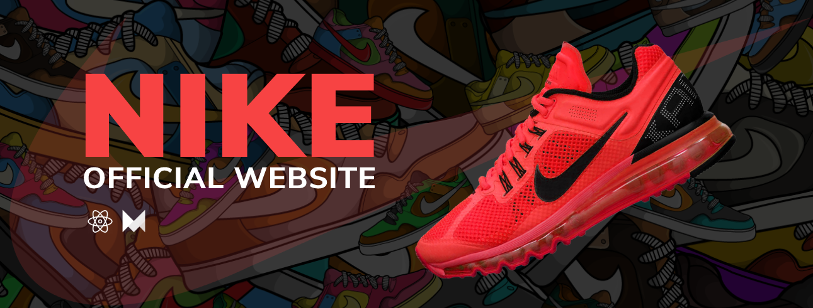

# Nike 1.0

## Table of Contents

- [Introduction](#introduction)
- [Features](#features)
- [Build Process](#build-process)
- [Tech Stack](#tech-stack)

 

## Introduction

Nike, Inc. is an American multinational corporation that is engaged in the design, development, manufacturing, and worldwide marketing and sales of footwear, apparel, equipment, accessories, and services.

This is a clone of the official nike website which was made only for educational purposes.

## Features

🚀 Animations using framer motion

## Build Process

- Clone or download the repo
- `npm install` or `yarn` to install dependencies
- `npm start` or `yarn run dev` to run the application

## Tech Stack

    
    
    
    

